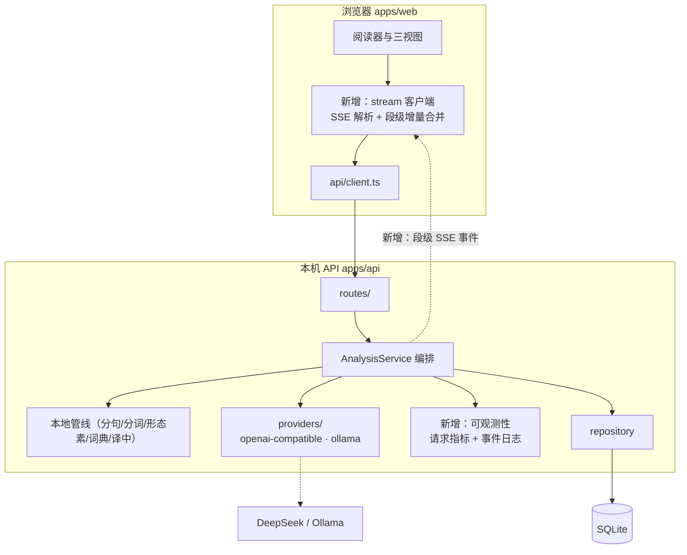
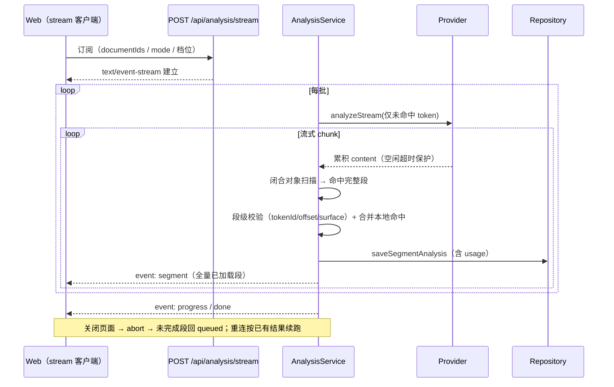

# 系统架构方案 v2

**版本**：v2 · 2026-09-12
**文档集**：本文属 v2 规划集，配套 [技术栈选型](tech-stack-v2.md) · [需求文档](requirements-v2.md) · [项目规划](roadmap-v2.md)
**取代关系**：本文取代 [architecture.md](architecture.md) 成为**目标态**权威；[system-architecture.md](system-architecture.md) 仍是**现状（as-built）**，两者不冲突。
**借鉴来源**：开源同类工具 [japanese-analyzer](../)（下称 JA），借鉴处逐条标注 `[JA:xxx]`。

---

## 一、系统边界

| 在系统内 | 在系统外（外部依赖） |
| --- | --- |
| 分句、确定性分词、形态素事实字段、词典查表与译中、任务编排、结果校验与合并、持久化、成本估算与预览、阅读器渲染与交互、人工修正版本 | 云端/本地 LLM（DeepSeek、Ollama）、浏览器能力（`localStorage`、`ResizeObserver`、`AbortController`）、JMDict 数据源（CC BY-SA 3.0） |

### 刻意不做（架构不变式）

明确写下来，防止后续误判为「遗漏」：

| 不做 | 理由 |
| --- | --- |
| 不再引入第二套分词权威 | token 边界只有本地一个来源，模型只能填空——已有 475 token 零差异的实测证据 |
| 不做账号、多人、公网部署 | 单人自用本机应用；一旦引入鉴权与多租户，全部 schema 和隐私假设作废 |
| 不做服务端渲染/SSR | 本机单用户，SSR 只增加复杂度 |
| 不让前端直接请求 LLM | API key 只存在本机服务端 |
| 不做 OCR / 图片 / PDF | 当前学习材料是文本；JA 有 OCR 是因为它是通用在线工具，定位不同 |
| 不把等级混入事实层 | `targetLevel` 只能影响解释层，不得改变 token、范围、语法事实 |
| 不用前端字符串搜索定位 | 全部走稳定 ID + UTF-16 偏移；重复词一旦串位，整个阅读器的信任就没了 |

---

## 二、架构总览（v2）

相对现状，v2 的结构性变化只有一处但很关键：**在「编排层 → 前端」之间新增一条流式事件通道**，其余分层保持不变。



**三条贯穿始终的约束**（前两条原有，第三条对齐 JA 后强化）：

1. **密钥不出服务端**；上游地址只能由服务端配置决定。
2. **一切可中断**：分析、译中、预览均支持 `AbortController`；取消后未完成段回到 `queued`，已完成段不回滚。
3. **结果必须可校验，且只推「已完整闭合且通过校验」的段** `[JA:analyzeStreamParser]`：半截 JSON、边界不符的段一律不上屏、不入库、不推前端。

---

## 三、v2 相对现状的变更

| 类别 | 项 | 说明 |
| --- | --- | --- |
| **新增** | 段级流式事件通道 | Ollama/DeepSeek 流中途扫描到**完整闭合的段落对象**即校验、落库、推送 `[JA]` |
| **新增** | 段级进度实时反馈 | 前端逐段上屏，不再「整批跑完才见结果」 |
| **新增** | 上下游统一超时策略 | 连接超时 + **流空闲超时**（逐 chunk 重置），超时先推错误事件再 abort `[JA:openaiProxy]` |
| **新增** | 请求指标与事件日志 | `first_segment_ms`、`duration_ms`、`error_category`；只记元数据不记原文 `[JA:analytics]` |
| **新增** | 上下文裁剪 | 长文只传邻句（现状已传前后各 1 句，v2 增加按段落收敛与 token 前缀定位）`[JA:wordDetailContext]` |
| **变更** | token 边界校验从「长度不等即失败」改为**逐项对齐修复** | 先按 tokenId/surface 对齐补全，仅补不丢，仍不符才失败 `[JA:reconcile]` |
| **变更** | JSON 解析增加**宽松兜底** | 严格失败后按字段边界截取 + 手写转义解码，允许半截响应产出部分字段 `[JA:parseLoose]` |
| **变更** | `App.tsx` 拆分为 hooks + 组件 | 前置条件，否则流式与标注都无法安全落地 |
| **变更** | 词性标签归一 | 模型词性标签漂移时归一到固定分组，保证配色/线型稳定 `[JA:normalizePosBase]` |
| **保持** | 本地确定性管线、词典三层、档位制、成本预览、修正版本化、ID 稳定性 | 这些是我们的**优势**，不因借鉴而改动 |

---

## 四、核心模块 v2

### 4.1 本地分析管线（保持，微调）

顺序不变：segmentation → tokenization → morphology → 固定用法库 → 内容词词典 → 译中 → LLM 兜底。

v2 微调：
- **词性归一**：新增 `normalizePos(partOfSpeech)`，把模型的自由词性文本（可能是「名詞」「noun」「名词-一般」）归一到固定分组，避免配色与线型抖动 `[JA:normalizePosBase]`。
- **罗马音本地生成**（P2）：若后续需要罗马音，**不交给模型**，用本地假名映射生成（拗音/促音/长音/助词特判），未知汉字返回空而不猜 `[JA:romaji]`。

### 4.2 编排层 AnalysisService（变更）

职责不变（装箱、并发、取消、重试、校验、合并），新增两项：

1. **流式增量产出**：不再等 `provider.analyze()` 整体返回，改为订阅 provider 的**增量事件流**。每拿到一个已闭合的段落对象，立即执行原有的段级校验与合并，成功即落库并向上 emit。
2. **首次反馈时间可观测**：记录 `first_segment_ms`。

保留的关键决策：provider 整批异常重试 1 次（间隔 1s）；**逐段校验失败不重试**（系统性偏差，重试无益）。

### 4.3 Provider 层（变更）

- 新增增量接口（不改现有 `analyze()` 的对外语义，两者并存）：

```ts
interface LlmProvider {
  analyze(request): Promise<LlmAnalysisResult>;          // 保持：整批返回
  analyzeStream?(request): AsyncIterable<SegmentDelta>;  // 新增：段级增量
}
```

`SegmentDelta` = `{ type: "segment", segmentId, analysis }` | `{ type: "usage", usage }` | `{ type: "error", message }`。

- **Ollama**：原生 `/api/chat` 已是 NDJSON 逐行流，现状是读完才解析；v2 改为边读边累积、边扫描闭合对象。同时启用 **流空闲超时**（默认 90s，逐 chunk 重置），避免本地 9B 卡死时无限等待 `[JA]`。
- **OpenAI 兼容**：SSE `delta.content` 累积，同样接入闭合对象扫描。
- 共用**闭合对象扫描器**（新模块 `json-stream-scanner.ts`）：单遍字符状态机（`depth / inString / escaped / objectStart`），只对闭合的 `{...}` 做 `JSON.parse`，内容非前缀时重置游标重扫 `[JA:analyzeStreamParser]`。

### 4.4 新增：可观测性层

| 指标 | 用途 |
| --- | --- |
| `analyze_start` / `analyze_success` / `analyze_error` / `analyze_cancel` | 每次分析**只发一个终态**，避免重复计数 |
| `first_segment_ms` / `duration_ms` | 体感与性能回归的核心指标 |
| `error_category` | 认证 / 限流 / 超时 / 非法 JSON / 边界不符 / 服务未启动 |
| `token_usage` / `cost` | 已有，纳入同一套事件 |

**隐私边界**：事件只含分类与数值，**不含原文、译文、密钥**。落本机 `data/events.jsonl`，默认关闭、设置页可开 `[JA:analytics]`。

### 4.5 前端（变更）

- **继续拆分 `App.tsx`**（现 937 行）：S0 已把纯函数与展示组件拆成 8 个模块（1763 → 937，见 [p1-enhancement-design.md](p1-enhancement-design.md) §S0），剩下的 `App()` 本体（约 865 行）承载全部状态逻辑，需拆为：`useAnalysis`（分析生命周期 + 流式订阅）、`useLibrary`（列表/搜索/筛选）、`useSettings`、`useTheme`，组件层保持纯展示 + 回调。
- **流式客户端** `streamAnalysis()`：`fetch` + `ReadableStream` 手动解析 SSE（不用 `EventSource`，因为需要 POST + 自定义请求体）。
- **渲染策略**：
  - 段级增量合并，按 `segmentId` 定位，**不重挂**已有段（React key 复用）`[JA]`。
  - 「正在分析」段显示脉冲占位；新段淡入（纯 CSS，不引动效库）。
  - 高度变化用 `ResizeObserver` + CSS transition 平滑，避免长文跳动。
- **不做 token 级逐词流式**：我们的模型输出是整段 JSON，未闭合时无法校验；段落级才是可用粒度。这是与 JA 的**有意差异**。

---

## 五、关键数据流：段级流式分析（v2 新增）



**关键不变量**：

1. 只有**通过校验**的段才 emit；校验失败的段 emit `event: error` 并标记 `failed`。
2. 段级 emit 与最终整批结果必须**等价**（用同一份校验/合并函数，禁止两条实现）。
3. 断线重连靠轮询 `GET /progress` + 已落库结果兜底，不依赖流状态。

---

## 六、关键设计决策与代价

| 决策 | 原因 | 代价 |
| --- | --- | --- |
| 本地先定 token 边界，模型只填空 | 定位绝对可靠；已实测 475 token 零差异 | 本地分词切错时模型无法纠正；边界校验失败只能整段重试 |
| 段级流式（而非词级） | 模型输出整段 JSON，未闭合无法校验 | 首段等待仍是一段的耗时（本地 9B 约 30-80s），不是「秒出」 |
| 流式与整批共用校验函数 | 两条实现必然漂移 | 校验函数必须容忍「部分已落库」状态 |
| 契约层 `default(null)` 降级 | 模型漏字段不该让 29 个正确字段作废 | 需在 UI 明确显示「未提供」，不能让 null 看起来像「没有这个语法点」 |
| 保留 sql.js 而非换原生驱动 | 免 Windows 原生编译，零环境摩擦 | 无增量落盘，需延迟批量写 + 原子替换；大库性能受限（见技术栈选型 §4） |
| 单机无鉴权 | 单人自用，只绑 127.0.0.1 | 一旦误绑 0.0.0.0 即无保护，需在启动日志强提醒 |
| 词性/类别由本地归一 | 模型标签漂移会毁掉配色与线型 | 归一会丢失模型的部分细粒度信息，需保留原始值备查 |
| 埋点默认关闭 | 隐私是本项目底线 | 排查线上问题需用户手动开启，信息窗口有限 |
| **分批保持确定性，不做运行时自适应** | 成本预估是对用户的承诺：同样的文章 + 同样的配置必须得到同样的钱 | 估算偏差只能用**离线标定**修正，不能靠运行时试探；自适应会让预估与实际漂移 |
| provider 自行声明输出估算能力 | 通用估算式按 DeepSeek thinking 标定，对本地模型高估约 3.8–4.8 倍，导致恒 1 段/批 | 每个 provider 需维护自己的标定系数，新增 provider 时多一步标定 |

> **落地结果（2026-09-13）**：`LlmProvider.outputTokenModel` 已实现，`apps/api/scripts/calibrate-output-model.ts`
> （`pnpm --filter @nihongonote/api calibrate`）可从落库 `usage_json` 直接标定系数。实测：
> 云端均值 593/段 + 247.5/字符（R² 仅 0.44，thinking 方差极大），本地均值 60.4/字符、上界 107.1/字符；
> 同一预算 6307 下本地能装 2 段（原先 1 段）。**仍需把 `LLM_BATCH_SIZE` 从 1 调大才能真正受益**。

---

## 七、从 japanese-analyzer 引入的资产（按价值/成本排序）

| # | 资产 | 解决什么 | 迁移代价 | 落地阶段 |
| --- | --- | --- | --- | --- |
| 1 | 请求指标与终态事件 | 目前完全没有可观测性，慢/失败只能猜 | 小 | M1 |
| 2 | 闭合对象增量扫描 | 流式的前提；只渲染可校验内容 | 小 | M1 |
| 3 | 流空闲超时 + 反向 abort | 本地模型卡死时无限等待 | 小 | M1 |
| 4 | 段级流式推送（SSE） | 长等待零反馈，体感最差的一环 | 中 | M1 |
| 5 | token 边界「逐项对齐修复」 | 现状一处不符即整段失败，重试成本高 | 小 | M1 |
| 6 | 宽松 JSON 兜底解析 | 半截/坏 JSON 时保住已产出的字段 | 小 | M2 |
| 7 | 词性归一 + 分组配色 | 词性标签漂移导致视觉不一致 | 小 | M2 |
| 8 | 上下文裁剪（段落收敛 + 前缀定位） | 长文 prompt 膨胀；`indexOf` 在重复词上会串位 | 小 | M2 |
| 9 | 本地罗马音 | 若引入罗马音，交模型既不省钱也不稳定 | 小 | M3 |
| 10 | 查词 LRU + 请求去重 | 重复点同一词会重复请求 | 小 | M3 |
| 11 | 逐段淡入 + 高度动画 | 长文增量上屏时布局跳动 | 小 | M1 |
| 12 | 文档写法：边界表 / 决策代价表 / 已知约束表 | 我们缺「刻意不做」和「代价」的显式记录 | 小 | 本次已纳入 |
| 13 | 最小块保护（防小尾巴） | 尾批过短时固定开销被浪费；他们用 min 180 + 两处小尾巴判定避免 | 小 | M1 |

---

## 八、明确不采纳的部分

| 不采纳 | 理由 |
| --- | --- |
| 无数据库 / 无历史 | 我们是长期学习工具，历史与可续跑是核心价值 |
| HMAC Cookie 门禁 | 本机单用户，服务只绑 `127.0.0.1`；引入反而增加密钥管理面 |
| 客户端直连第三方 TTS | 违反「密钥与端点由服务端决定」的既有约束 |
| 分块 280/420/180 字符策略 | 我们的分块单位是**句段 + 成本装箱**，句子边界已由本地确定性给出，比字符分块更硬 |
| 整段文本「拼接还原」校验 | 我们不需要——边界本地已定，替换为对着 `tokenBoundaries` 的逐项对齐 |
| `response_format: json_schema` 按厂商分流 | 当前 Ollama 不发 `response_format`、DeepSeek 用 `json_object`，已有等价机制；不新增维护面 |

---

## 九、已知约束与改进方向

| 约束 | 影响 | 方向 |
| --- | --- | --- |
| ~~`App.tsx` 本体未拆~~（**已解决 2026-09-13**） | 曾阻塞流式、范围标注、移动端抽屉 | 现为 554 行：5 个 hooks（theme / library / serviceStatus / composer / readingSession）+ 纯布局；流式订阅将落进 `useReadingSession` |
| 本地 9B 单段 30-80s | 长文整体耗时仍是分钟级 | 段落级流式改善体感；另评估更小模型 / 更激进档位 |
| ~~批处理对本地模型空转~~（**已修 2026-09-13**） | 原估算式按 DeepSeek 标定，本地恒为 1 段/批 | 已改为 `provider.outputTokenModel` + `calibrate` 离线标定（本地 107.1/字符）；调大 `LLM_BATCH_SIZE` 后即可合并 |
| sql.js 无增量落盘 | 崩溃丢最后 2s 写入 | 已用 `recoverInterruptedAnalyses()` 兜底；后续评估 `node:sqlite`（见技术栈 §4） |
| 无自动化测试框架 | 回归靠 `verify-pipeline.ts` 脚本 | M3 引入 vitest，并把脚本按模块拆分 |
| 词典覆盖率 92.7% 后边际收益递减 | 继续扩词典性价比下降 | 转向「上下文裁剪 + 档位」降本 |
| 无服务端限流 | 本机自用风险低；若未来多设备接入则需补 | 保留 `_utils` 式统一入口，便于后置限流 |
