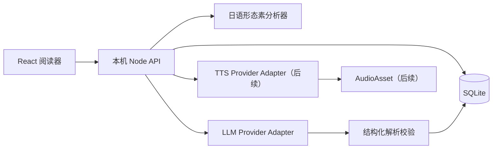

# 技术架构方案

**状态**：第一版推荐方案（已确定首个 LLM 接入路径和 P1 MVP 边界）
**适用范围**：单用户、本机 Web 应用、允许使用云端 LLM；TTS provider 仅预留接口

## 一、总体架构



核心原则是：浏览器只负责展示，本机服务负责 API 密钥、任务编排、数据落盘和第三方 LLM 调用。

## 二、推荐技术栈

项目采用简单的 TypeScript 单仓库：

- 前端：React + TypeScript + Vite，位于 `apps/web/`；
- 本机后端：Node.js + TypeScript + Fastify，位于 `apps/api/`；
- 共用领域包：`packages/core/`，存放 Zod schema 和类型；
- 数据库：SQLite，通过 `sql.js`/WASM 运行在本机服务中，避免要求用户安装 C++ 原生编译工具；
- 校验：运行时 schema 校验库，例如 Zod；
- 分词：服务端确定性日语 token 边界；当前使用 Node `Intl.Segmenter` 的日语 word segmentation，后续可替换为 kuromoji.js 等形态素分析器；
- TTS：通过 `TtsProvider` 预留标准日语朗读接口，当前保持 disabled；
- 包管理：pnpm workspace。

这套栈适合本地部署的原因是组件少、运行成本低、API 密钥不经过浏览器，也保留将来拆分或公网部署的空间。当前选择 `sql.js` 是为了让 Windows 开发环境不依赖 `better-sqlite3` 的原生模块编译；数据库在内存中运行，在写入后导出回本地 SQLite 文件。

当前代码已经提供文章保存、SQLite 初始化、健康检查、基础分句、确定性 token 边界、前端阅读预览、基于官方 OpenAI SDK 的 DeepSeek OpenAI-compatible adapter 和句段分析任务；TTS provider 当前保持 disabled，更细的日语形态素字段及 Anthropic-compatible adapter 仍保持为后续适配器边界。P1 先以 token + 句子两层形成可验证闭环，完整范围标注和等级解释分层在不破坏稳定 ID 的前提下逐步加入。

## 三、模块边界

### 3.1 前端阅读器

职责：

- 文本输入和标题；
- 用户手动选择为主、自动识别只提供建议的文章类型和混合区块预览；
- “是否参与解析”的区块开关；
- 在一个连续阅读框中渲染文章、段落和句子；
- 将 token 偏移映射到原文；
- P1 MVP 的句子层和 token 层渲染与解析卡片；
- 后续的背景范围、词语线型和重叠标注分层渲染；
- 后续的词语/助词/功能词/副词悬浮高亮和逐层点击状态；
- 首版“编辑解析”模式下的标题、角色和解析字段修正；
- 后续的区块、分句和标注范围修正；
- 分析进度、失败重试和错误提示；
- 分析取消：中止当前云端请求并停止后续请求，保留已完成结果；
- 可折叠学习库、历史列表、搜索和分析状态筛选；内容类型筛选后续加入。

前端不得：

- 保存或暴露 LLM API 密钥；
- 直接解析非结构化模型回答；
- 用前端字符串搜索代替服务端稳定 ID。

### 3.2 本机 API 和任务编排

职责：

- 文档和段落 CRUD；
- 内容区块、句子切分和分词；
- 长文本切块和上下文窗口；
- 调用 LLM、校验结果、保存状态；
- 取消分析并中止正在进行的云端请求，将未完成句段恢复为可续跑状态；
- 保存 AI 原始结果和用户修正版本；
- 删除、搜索和分析状态筛选；内容类型筛选作为后续扩展；
- 统一错误、重试和取消。

建议的接口（名称可在实现时微调）：

```text
POST   /api/documents
GET    /api/documents
GET    /api/documents/:documentId
PATCH  /api/documents/:documentId
DELETE /api/documents/:documentId

POST   /api/documents/:documentId/analyze
POST   /api/documents/:documentId/analyze/cancel
GET    /api/documents/:documentId/progress
POST   /api/segments/:segmentId/retry
PATCH  /api/documents/:documentId/blocks/:blockId
PATCH  /api/segments/:segmentId/annotations

GET    /api/search?q=...&status=...
```

以下接口仅作为后续 TTS 播放预留，不属于当前版本：

```text
POST   /api/segments/:segmentId/audio
GET    /api/audio/:audioId
```

第一版是单用户本机应用，不需要账号认证；仍应限制请求体大小、校验文件类型和将服务绑定到 `127.0.0.1`。

## 四、AI 分析流水线

1. **输入规范化**：保留原文、换行和标点，生成文档版本。
2. **区块和句子切分**：空行划分独立段落/区块；再按标题/注释候选、日语标点和对话标记生成稳定的 block/segment ID，句末标点属于句子范围。普通单换行只作为保留的排版空白，不自动创建新的段落或句子；说话人标签保留在原文中但单独存储，不进入日语 token 或 AI 分析；保留用户对区块类型和分析开关的覆盖。
3. **本地 token 边界**：保存后自动使用确定性日语分词取得 surface 和字符偏移，不产生云端调用；用户启动深度分析后，模型只补充原形、读音、词性、词义和语法字段。
4. **分块**：按段落和 token/字符上限组合请求；每块携带有限的前后文。
5. **结构化生成**：用户启动深度分析后，先生成与目标等级无关的 `CanonicalAnalysis`；P1 MVP 先使用其中的句子和 token 事实，等级化教学表达由独立的 `LevelExplanation` 生成。要求模型只返回版本化 JSON，不让前端依赖 Markdown。
6. **schema 校验**：校验 block/segment ID、token 范围、跨 token 标注范围和必填字段；基础事实和等级表达都必须通过对应 schema，失败则标记为失败并显示原因。
7. **落盘**：每个 segment 独立保存 canonical 结果；等级表达按 `canonicalAnalysisId + targetLevel + explanationVersion` 保存或缓存。支持增量展示、取消当前云端请求和断点续跑。
8. **人工修正入口**：首版允许修正标题、角色和解析字段；后续再开放区块、分句和标注范围修正。修正不应覆盖原始模型响应，并区分事实修正与表达修正。

### 结构化输出要求

模型响应必须至少包含：

- 文档版本和分析协议版本；
- 独立于目标等级的 canonical 分析版本；
- segment ID；
- 每个 token 的偏移或 token ID；
- 词汇/助词/语法解释；
- 句意、基础语气/态度、总体礼貌等级（随意/普通/礼貌/尊敬/自谦）、具体语体/敬语形式标签（普通体、敬体、尊敬语、自谦语、丁寧语/礼貌表达、郑重语、商务正式表达）、潜台词及其原文依据；
- `translation` 默认是自然中文译文；直译字段按用户主动请求按需生成，不作为首次深度分析的必填输出；
- 对话中的上下文和回复理由；首版以自然语言为主；
- `confidence` 或 `uncertaintyNote`；
- 模型无法判断时的明确标记。
- 内容类型/区块类型建议和识别依据；用户手动指定的类型优先于模型建议。
- 后续版本的多词语法、语气/态度/隐含意义范围及其 token ID。
- 后续版本的稳定会话标签、强度等级和 evidence token/range ID；首版不要求用它们替代自然语言说明。
- 对话关系引用的相邻 segment ID；非对话材料没有依据时返回空关系。

目标等级只允许影响 `LevelExplanation` 中的说明深度、术语复杂度和教学例子，不得改变 `CanonicalAnalysis` 的 token、范围、语法事实或原文证据。

推荐把“原始响应”和“规范化结果”分开保存，方便排查模型质量问题。

### 长文章策略

- 不把整篇文章强行塞入一次请求；
- 尽量以段落为边界，必要时再按句子拆分；
- 每块带上前后若干句，而只保存当前块负责的 segment；
- 为每块生成幂等 key，避免重复扣费；
- 失败段落可单独重试；
- 取消时中止当前云端请求，并阻止队列继续发出新的请求；
- 在 UI 中显示当前块和预计剩余段数；
- 跨块引用保持文档内 segment ID，不复制大量原文。

### 连续文章和分层标注实现方案

#### P1 MVP 边界

P1 MVP 只实现两个可交互层次：

1. **句子层**：使用稳定的 segment ID 显示句子范围、句意、语气和上下文说明。
2. **token 层**：使用本机生成的 token ID 和 UTF-16 偏移显示词语事实和词语解析。

语法范围、语气/态度范围、重叠色块、线型和四层循环点击先作为 `AnnotationRange`、evidence ID 和交互状态的扩展边界，不因 MVP 而使用字符串搜索或嵌套可点击元素替代稳定定位。

#### 原文和范围模型（完整版本）

1. 保存前输入仍可编辑；保存后服务端保留不可变的 `sourceText`，所有 block、segment、token 和 annotation range 都使用相对于原文/句段的 UTF-16 偏移与稳定 ID。
2. `ContentBlock` 表示标题、正文、对话、例句或注释等区块，带有检测类型、用户选择类型和 `analysisEnabled`。标题、编号和中文注释默认关闭解析，正文和日语例句默认开启。
3. `TokenAnalysis` 只表示确定性的词语边界；跨多个 token 的分句、语法、语气和态度使用 `AnnotationRange` 表示，并通过 token ID 关联。
4. AI 返回的范围必须通过原文切片、ID 归属和边界检查。无法验证的范围不能进入完成状态，只能进入失败或待人工修正状态。

#### 前端分层渲染（完整版本）

前端不为每个句子创建独立卡片，而是把完整文章切成最小连续文本片段，再为每个片段计算两套互相独立的视觉属性：

- **背景层**：句子范围显示为最宽的底层背景；普通词、助词、助动词/其他功能词和副词使用较浅分类色块覆盖其上；多词语法的结构色块再覆盖对应词语范围。不为分句单独设置背景色，句子底色支持跨行显示。
- **线型层**：普通词使用单层下划线，严格助词使用双层下划线，助动词/其他功能词使用虚线下划线，副词使用独立线色的单层下划线，多词语法使用单层波浪线，语气/态度/隐含意义使用双层波浪线。
- 多词语法的整体背景和波浪线覆盖整个范围，但内部 token 的分类色块和下划线仍可呈现；背景层叠加是有意设计，不使用无语义的额外颜色。
- 默认渲染所有可识别 token；按词性筛选属于前端显示状态，不得从已保存分析结果中删除 token。
- 类别颜色具有固定语义，但不是唯一分类依据；图例、线型、焦点状态和可读的文字标签必须同步提供。颜色主题应使用统一设计 token，允许用户切换预设或调整，并以对比度和色盲可辨识性验收。

实现上建议使用区间扫描（interval sweep）或等价的范围切分算法，先生成不重叠的原文片段，再合并背景层和线型层属性。不要通过嵌套多个可点击 `<button>` 表达重叠范围，否则会产生非法交互嵌套、焦点顺序和点击冒泡问题。

#### 点击、悬浮和锚点卡片（完整版本）

- 维护 `selectedSourceRange`、`interactionStage` 和当前卡片状态；同一原文位置重复点击时按“句子结构 → 词语/助词/功能词/副词 → 多词语法 → 语气/态度”循环，缺少对应标注时跳过该层，点击其他位置将阶段重置为第一层，点击文章外关闭卡片。
- 悬浮只强化当前范围，不显示弹窗；句子、词语、助词、功能词、副词、语法和语气的完整解释统一在点击后打开。
- 桌面端锚点卡片使用触发元素的几何位置计算，接近视口边缘时自动换位，并设置最大高度和滚动区域，避免遮住触发位置或溢出视口。
- 移动端使用底部抽屉或侧边面板承载完整解析，不依赖 hover；键盘焦点和图例应能到达所有可交互范围。

#### 内容类型、对话关系和编辑版本

- 文章级类型以用户手动选择为主，区块级自动识别只提供建议；用户手动选择的区块类型和解析开关优先于 AI 建议。
- 句意、语法、语气和不确定性是通用字段；首版对话关系只在有角色/上下文依据时生成自然语言原因，稳定标签、强度和 evidence range 后续加入。
- “编辑解析”采用版本化或快照方式保存。首版先支持标题、角色和解析字段修正；用户修正与 AI 原始结果分开，重新分析时不得静默覆盖用户版本；若范围被重新分词，必须显示冲突并要求用户选择。

#### 学习库布局

- 桌面端使用可收缩的窄侧栏/图标轨道，折叠后主阅读区扩展；手机端使用覆盖主内容的抽屉。
- 展开状态、搜索词和筛选条件属于前端界面状态；折叠偏好保存到本机浏览器。
- 列表 API 首版支持最近更新时间、搜索和分析状态筛选；内容类型筛选后续加入，第一版不引入文件夹和标签层级。`targetLevel` 作为教学表达偏好保留，不作为学习库筛选条件。

## 五、Provider Adapter

### LLM adapter

统一接口的长期目标应拆成两个阶段：

```text
analyzeCanonical(segments, context, promptVersion) -> CanonicalAnalysis
generateLevelExplanation(canonicalAnalysis, targetLevel, promptVersion) -> LevelExplanation
```

`CanonicalAnalysis` 是事实和结构的唯一来源；`LevelExplanation` 只负责面向目标等级的教学表达。用户切换等级时只重新生成或读取 `LevelExplanation`，不重新分词、不重新请求基础事实，也不改变前端定位。

当前 `LlmProvider.analyze()` 仍可作为过渡接口，但其实现必须把 `targetLevel` 限制在解释语义中，不能让不同等级产生不同 token、范围或语法事实。后续拆分接口时，前端和稳定 ID 不应改变。

第一阶段实现两个层次：

```text
LlmProvider                       业务层统一接口
├── OpenAiCompatibleLlmProvider    P1 首先实现，连接 DeepSeek/OpenAI/其他兼容服务
└── AnthropicMessagesLlmProvider   后续实现，连接 Anthropic-compatible 服务
```

provider 配置建议抽象为：

```text
provider, protocol, baseUrl, apiKey, model,
temperature, maxTokens, timeoutMs
```

TTS 预留配置为 `TTS_PROVIDER`、`TTS_VOICE`、`TTS_SPEED`、`TTS_FORMAT` 和
`TTS_SSML_VERSION`；这些配置当前可以为空，`TTS_PROVIDER=disabled` 时不得发起第三方请求。

首个 DeepSeek 配置的协议层示例：

```text
provider: deepseek
protocol: openai
baseUrl: https://api.deepseek.com
endpoint: /chat/completions
```

后续 Anthropic-compatible 配置：

```text
provider: deepseek
protocol: anthropic
baseUrl: https://api.deepseek.com/anthropic
endpoint: /messages
```

第一版使用本机服务端的官方 OpenAI SDK 发送 OpenAI-compatible 请求，并在协议 adapter 内完成请求/响应转换，而不是让业务层直接依赖某家服务的响应对象。这样可以同时支持 DeepSeek、OpenAI、其他 OpenAI-compatible 服务和后续 Anthropic-compatible 端点。

适配器负责：

- 供应商认证；
- 根据协议序列化请求并解析响应；
- 模型和温度等参数；
- 结构化输出配置；
- 限流、超时和错误分类；
- token 使用量记录；
- 将供应商错误转为本机 API 的可读错误。

#### OpenAI-compatible 适配器（已实现）

P1 使用官方 OpenAI SDK 的 `chat.completions.create()`，通过 `baseURL: https://api.deepseek.com` 访问
`/chat/completions`。请求至少包含 system/user messages、model、`max_tokens` 和
`response_format: { type: "json_object" }`；DeepSeek 推理配置还包括 `thinking` 和
`reasoning_effort`。system 或 user prompt 必须明确包含 JSON 输出要求和示例。

当前默认的 DeepSeek 配置是 `deepseek-v4-flash`、`thinking.type=enabled` 和
`reasoning_effort=high`；具体模型和参数通过环境变量覆盖。OpenAI SDK 的自动重试显式关闭，
避免一次分析因 SDK 重试产生重复请求、重复费用或额外等待。

适配器必须显式处理：

- HTTP 非 2xx；
- `choices[0].message.content` 缺失或为空；
- `finish_reason` 表示长度截断；
- 返回内容不是合法 JSON；
- JSON 合法但不符合 NihongoNote schema；
- provider 返回的 segment/token ID 不属于本次请求；
- provider 返回的 token 边界与本地 token 边界不一致。

DeepSeek 官方 JSON Output 说明还提示可能出现空内容或截断，因此不能把 HTTP 成功直接当作分析成功。
当前模板将 `LLM_MAX_TOKENS` 默认设为 `32000`，长句仍应根据实际响应和 provider 上限调整；API 中途重启后，启动恢复逻辑会把 `processing` 句段重新置为 `queued`，避免任务永久卡住。

分析服务当前按句段串行调用 provider，以便独立保存成功结果和重试失败句段；因此长对话的总耗时约为
各句段请求耗时之和。启用 `LLM_DEBUG_LOGGING=true` 后，服务会把每次调用的实际请求体、响应内容、
耗时和错误追加到默认数据目录的 `llm-debug.jsonl`，但不写入 Authorization header 或 API key。
调试日志会包含原文，排查完成后应关闭开关并删除日志。

2026-08-28 已用真实 DeepSeek key 验证一段商务发言：原文包含三个句末标点，因此拆成
3 个 segment；`deepseek-v4-flash`、`thinking=enabled`、`reasoning_effort=high` 下 3/3
返回 `finish_reason=stop` 并通过本地 schema 校验。三次串行调用耗时约 76.7 秒、64.3 秒和
166.1 秒；这说明当前延迟主要来自推理型模型的生成时间与逐句串行策略，而不是前端等待或重试。

#### Anthropic-compatible 适配器（后续实现）

后续使用 `/messages`，将 system、messages、max tokens 和文本 content 转换为内部请求。只依赖协议兼容层公开支持的基础字段，不依赖某家服务的缓存、文档或特殊 thinking 字段。解析后统一转为内部 `CanonicalAnalysis` 或 `LevelExplanation`，前端和数据库不感知协议差异。

前端只知道“分析成功/进行中/失败”，不应依赖某个供应商的响应格式。

## 六、TTS adapter（后续预留）

当前版本不生成或播放音频，但保留独立的 TTS provider 接口：

```text
synthesize(request: TtsRequest) -> TtsResult

TtsRequest:
  text, voice, speed, format, ssmlVersion?, prosody

TtsResult:
  provider, voice, format, audio
```

未来 TTS 至少需要支持：

- 标准、清晰的日语朗读发音；
- 按句子或段落播放、暂停、继续和从当前句开始；
- 根据标点、普通排版换行和对话轮次产生合理停顿；
- 语速调整；
- 记录 provider、voice、语速、发音/韵律参数、格式和文本版本；
- 按文本、voice、语速、韵律参数和格式缓存。

TTS provider 不应进入当前 P1 的分析任务；当前只保留接口、配置边界和 `AudioAsset` 数据模型，不实现录音或跟读。

## 七、成本和缓存

建议记录每次第三方调用的最小元数据：

```text
provider, model, promptVersion, inputUnits, outputUnits,
segmentCount, cacheHit, startedAt, completedAt, errorCode
```

不要在普通日志中写入完整文章。canonical 缓存 key 至少包含：

```text
hash(sourceText, tokenizerVersion, promptVersion, model, canonicalSchemaVersion)
```

等级解释缓存 key 在 canonical key 基础上增加：

```text
targetLevel, explanationVersion
```

## 八、隐私和错误处理

### 隐私

- LLM/TTS API 密钥只从本机环境变量读取；当前 TTS provider 未启用；
- 服务默认只监听本机；
- 关闭详细内容日志；
- 在设置页显示当前 provider 和“内容会发送到云端”的提醒；
- 提供删除文章和分析结果的操作；
- 文档中记录各供应商的保存/训练政策，实施时以官方政策为准。

### 错误分类

至少区分：

- 输入为空或超过本地限制；
- provider 认证失败；
- provider 限流；
- provider 网络超时；
- 模型返回无法校验的 JSON；
- 数据库读写失败。

每类错误要显示可行动的提示。不能把失败段落写成“已完成”，也不能用空字符串静默替代模型结果。

## 九、Agent/skill 的接入点

等 Web 应用稳定后，可增加一个可复用的分析 skill：

- 输入：一个或多个 segment、上下文，以及可选的目标难度；
- 输出：与 Web API 相同版本的 `CanonicalAnalysis` 和/或 `LevelExplanation` 结构化 JSON；
- Web 后端和 Agent 共用同一份 schema 和提示词版本；
- Agent 可用于“深入解释当前句子”或批量导入；
- skill 不直接持有数据库和 API 密钥，调用权限由宿主或本机服务负责。

这条路径能复用分析逻辑，而不需要牺牲 Web 应用的原文交互。

## 十、待实现时确认的技术决策

1. DeepSeek OpenAI-compatible API 在两篇商务材料和新增普通文章上的真实解析质量、JSON 稳定性、延迟和费用；
2. DeepSeek 的具体模型名称、限流和价格，实施时以官方文档/控制台为准；
3. Anthropic-compatible adapter 是否在 P1 后有实际价值，以及需要支持的最小字段集合；
4. 日语形态素分析器在助词、口语缩约和重复词上的偏移准确率；
5. TTS provider 的标准发音、停顿、语速控制、费用和缓存行为。
