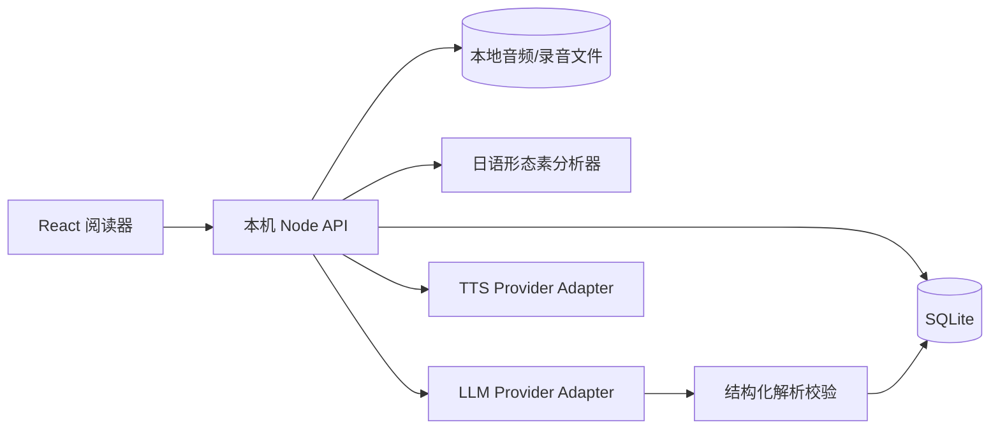

# 技术架构方案

**状态**：第一版推荐方案（已确定首个 LLM 接入路径）
**适用范围**：单用户、本机 Web 应用、允许使用云端 AI/TTS

## 一、总体架构



核心原则是：浏览器只负责展示和录音，本机服务负责 API 密钥、任务编排、数据落盘和第三方调用。

## 二、推荐技术栈

项目采用简单的 TypeScript 单仓库：

- 前端：React + TypeScript + Vite，位于 `apps/web/`；
- 本机后端：Node.js + TypeScript + Fastify，位于 `apps/api/`；
- 共用领域包：`packages/core/`，存放 Zod schema 和类型；
- 数据库：SQLite，通过 `sql.js`/WASM 运行在本机服务中，避免要求用户安装 C++ 原生编译工具；
- 文件：项目 `data/` 下的音频和录音目录；
- 校验：运行时 schema 校验库，例如 Zod；
- 分词：服务端确定性日语 token 边界；当前使用 Node `Intl.Segmenter` 的日语 word segmentation，后续可替换为 kuromoji.js 等形态素分析器；
- 录音：浏览器 `MediaRecorder`；
- 包管理：pnpm workspace。

这套栈适合本地部署的原因是组件少、运行成本低、API 密钥不经过浏览器，也保留将来拆分或公网部署的空间。当前选择 `sql.js` 是为了让 Windows 开发环境不依赖 `better-sqlite3` 的原生模块编译；数据库在内存中运行，在写入后导出回本地 SQLite 文件。

当前代码已经提供文章保存、SQLite 初始化、健康检查、基础分句、确定性 token 边界、前端阅读预览、DeepSeek OpenAI-compatible adapter 和句段分析任务；更细的日语形态素字段、TTS 及 Anthropic-compatible adapter 仍保持为后续适配器边界。

## 三、模块边界

### 3.1 前端阅读器

职责：

- 文本输入、标题和难度设置；
- 文章、段落和句子渲染；
- 将 token 偏移映射到原文；
- 词语/助词悬浮卡片和句子详情面板；
- 分析进度、失败重试和错误提示；
- 播放音频、申请麦克风、录音和回放；
- 历史列表和搜索。

前端不得：

- 保存或暴露 LLM/TTS API 密钥；
- 直接解析非结构化模型回答；
- 用前端字符串搜索代替服务端稳定 ID。

### 3.2 本机 API 和任务编排

职责：

- 文档和段落 CRUD；
- 分词和句子切分；
- 长文本切块和上下文窗口；
- 调用 LLM、校验结果、保存状态；
- TTS 生成与缓存；
- 录音文件元数据保存；
- 删除和搜索；
- 统一错误、重试和取消。

建议的接口（名称可在实现时微调）：

```text
POST   /api/documents
GET    /api/documents
GET    /api/documents/:documentId
PATCH  /api/documents/:documentId
DELETE /api/documents/:documentId

POST   /api/documents/:documentId/analyze
GET    /api/documents/:documentId/progress
POST   /api/segments/:segmentId/retry

POST   /api/segments/:segmentId/audio
GET    /api/audio/:audioId
POST   /api/segments/:segmentId/recordings
GET    /api/recordings/:recordingId
DELETE /api/recordings/:recordingId

GET    /api/search?q=...
```

第一版是单用户本机应用，不需要账号认证；仍应限制请求体大小、校验文件类型和将服务绑定到 `127.0.0.1`。

## 四、AI 分析流水线

1. **输入规范化**：保留原文、换行和标点，生成文档版本。
2. **句子切分**：按日语标点、换行和对话标记生成稳定的 segment ID。
3. **本地 token 边界**：使用确定性日语分词取得 surface 和字符偏移；模型只补充原形、读音、词性、词义和语法字段。
4. **分块**：按段落和 token/字符上限组合请求；每块携带有限的前后文。
5. **结构化生成**：要求模型只返回版本化 JSON，不让前端依赖 Markdown。
6. **schema 校验**：校验 segment ID、token 范围和必填字段；失败则标记为失败并显示原因。
7. **落盘**：每个 segment 独立保存，支持增量展示和断点续跑。
8. **人工修正入口**：允许修正角色、难度和明显错误；修正不应覆盖原始模型响应。

### 结构化输出要求

模型响应必须至少包含：

- 文档版本和分析协议版本；
- segment ID；
- 每个 token 的偏移或 token ID；
- 词汇/助词/语法解释；
- 句意、语气、礼貌程度、潜台词；
- 对话中的上下文和回复理由；
- `confidence` 或 `uncertaintyNote`；
- 模型无法判断时的明确标记。

推荐把“原始响应”和“规范化结果”分开保存，方便排查模型质量问题。

### 长文章策略

- 不把整篇文章强行塞入一次请求；
- 尽量以段落为边界，必要时再按句子拆分；
- 每块带上前后若干句，而只保存当前块负责的 segment；
- 为每块生成幂等 key，避免重复扣费；
- 失败段落可单独重试；
- 在 UI 中显示当前块和预计剩余段数；
- 跨块引用保持文档内 segment ID，不复制大量原文。

## 五、Provider Adapter

### LLM adapter

统一接口应包含：

```text
analyze(segments, context, targetLevel, promptVersion) -> ValidatedAnalysis
```

第一阶段实现两个层次：

```text
LlmProvider                       业务层统一接口
├── OpenAiCompatibleLlmProvider    P1 首先实现，连接 DeepSeek/OpenAI/其他兼容服务
└── AnthropicMessagesLlmProvider   后续实现，连接 Anthropic-compatible 服务
```

provider 配置建议抽象为：

```text
provider, protocol, baseUrl, apiKey, model,
temperature, maxTokens, timeoutMs
```

首个 DeepSeek 配置的协议层示例：

```text
provider: deepseek
protocol: openai
baseUrl: https://api.deepseek.com
endpoint: /chat/completions
```

后续 Anthropic-compatible 配置：

```text
provider: deepseek
protocol: anthropic
baseUrl: https://api.deepseek.com/anthropic
endpoint: /messages
```

第一版建议使用本机服务端原生 `fetch` 发送请求，并在协议 adapter 内完成请求/响应转换，而不是让业务层直接依赖某个 SDK 的响应类型。这样可以同时支持 DeepSeek、OpenAI、Anthropic-compatible 服务和其他兼容端点。

适配器负责：

- 供应商认证；
- 根据协议序列化请求并解析响应；
- 模型和温度等参数；
- 结构化输出配置；
- 限流、超时和错误分类；
- token 使用量记录；
- 将供应商错误转为本机 API 的可读错误。

#### OpenAI-compatible 适配器（已实现）

P1 使用 `/chat/completions`，请求至少包含 system/user messages、model、`max_tokens` 和 `response_format: { type: "json_object" }`。system 或 user prompt 必须明确包含 JSON 输出要求和示例。

适配器必须显式处理：

- HTTP 非 2xx；
- `choices[0].message.content` 缺失或为空；
- `finish_reason` 表示长度截断；
- 返回内容不是合法 JSON；
- JSON 合法但不符合 NihongoNote schema；
- provider 返回的 segment/token ID 不属于本次请求；
- provider 返回的 token 边界与本地 token 边界不一致。

DeepSeek 官方 JSON Output 说明还提示可能出现空内容或截断，因此不能把 HTTP 成功直接当作分析成功。

#### Anthropic-compatible 适配器（后续实现）

后续使用 `/messages`，将 system、messages、max tokens 和文本 content 转换为内部请求。只依赖协议兼容层公开支持的基础字段，不依赖某家服务的缓存、文档或特殊 thinking 字段。解析后统一转为内部 `SegmentAnalysis[]`，前端和数据库不感知协议差异。

前端只知道“分析成功/进行中/失败”，不应依赖某个供应商的响应格式。

### TTS adapter

统一接口应包含：

```text
synthesize(text, voice, prosody, ssmlVersion) -> AudioAsset
```

第一版默认一个自然的东京式日语音色。应保留以下参数：

- provider；
- voice；
- 角色；
- 语速；
- 音高；
- 停顿/SSML 版本；
- 输出格式。

这样后续可以为不同角色绑定不同音色和语气，而不改变文章数据模型。

## 六、录音设计

- 浏览器使用 `MediaRecorder`，录制当前句或段落；
- 上传前在浏览器检查录音是否有数据；
- 服务端保存原始 MIME 类型、扩展名、时长和 segment ID；
- 默认保存到本地文件系统，SQLite 只保存元数据和相对路径；
- 删除文章时清理关联文件，清理失败必须显示错误并保留可重试状态；
- 暂不做发音评分，但数据模型不应阻止未来保存对齐结果。

## 七、成本和缓存

建议记录每次第三方调用的最小元数据：

```text
provider, model, promptVersion, inputUnits, outputUnits,
segmentCount, cacheHit, startedAt, completedAt, errorCode
```

不要在普通日志中写入完整文章或录音。缓存 key 至少包含：

```text
hash(sourceText, tokenizerVersion, promptVersion, model, targetLevel)
```

TTS 缓存还应包含 voice、prosody 和格式，否则切换语速/音色时可能错误复用旧音频。

## 八、隐私和错误处理

### 隐私

- API 密钥只从本机环境变量读取；
- 服务默认只监听本机；
- 关闭详细内容日志；
- 在设置页显示当前 provider 和“内容会发送到云端”的提醒；
- 提供删除文章、分析、TTS 和录音的操作；
- 文档中记录各供应商的保存/训练政策，实施时以官方政策为准。

### 错误分类

至少区分：

- 输入为空或超过本地限制；
- 麦克风权限被拒绝；
- provider 认证失败；
- provider 限流；
- provider 网络超时；
- 模型返回无法校验的 JSON；
- 音频文件写入失败；
- 数据库读写失败。

每类错误要显示可行动的提示。不能把失败段落写成“已完成”，也不能用空字符串静默替代模型结果。

## 九、Agent/skill 的接入点

等 Web 应用稳定后，可增加一个可复用的分析 skill：

- 输入：一个或多个 segment、上下文、目标难度；
- 输出：与 Web API 相同版本的结构化 JSON；
- Web 后端和 Agent 共用同一份 schema 和提示词版本；
- Agent 可用于“深入解释当前句子”或批量导入；
- skill 不直接持有数据库和 API 密钥，调用权限由宿主或本机服务负责。

这条路径能复用分析逻辑，而不需要牺牲 Web 应用的原文交互。

## 十、待实现时确认的技术决策

1. DeepSeek OpenAI-compatible API 在两篇商务材料和新增普通文章上的真实解析质量、JSON 稳定性、延迟和费用；
2. DeepSeek 的具体模型名称、限流和价格，实施时以官方文档/控制台为准；
3. Anthropic-compatible adapter 是否在 P1 后有实际价值，以及需要支持的最小字段集合；
4. TTS 候选供应商的日语音色、SSML 和费用；
5. 日语形态素分析器在助词、口语缩约和重复词上的偏移准确率；
6. 浏览器录音格式在目标浏览器中的兼容性。
