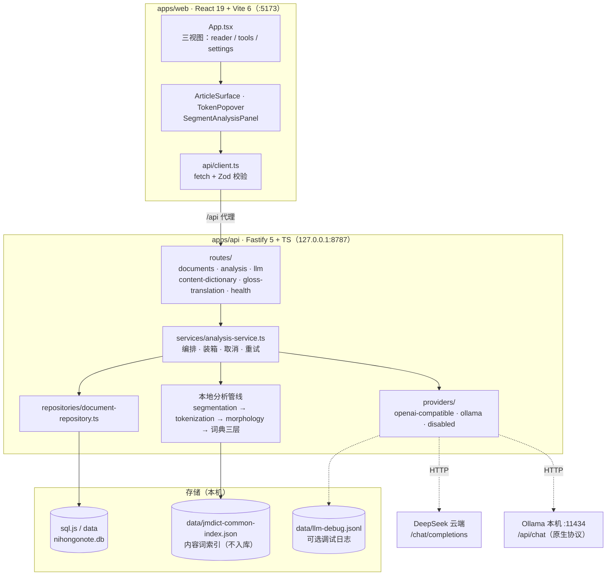
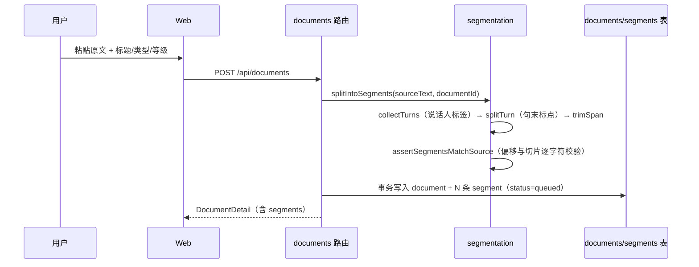
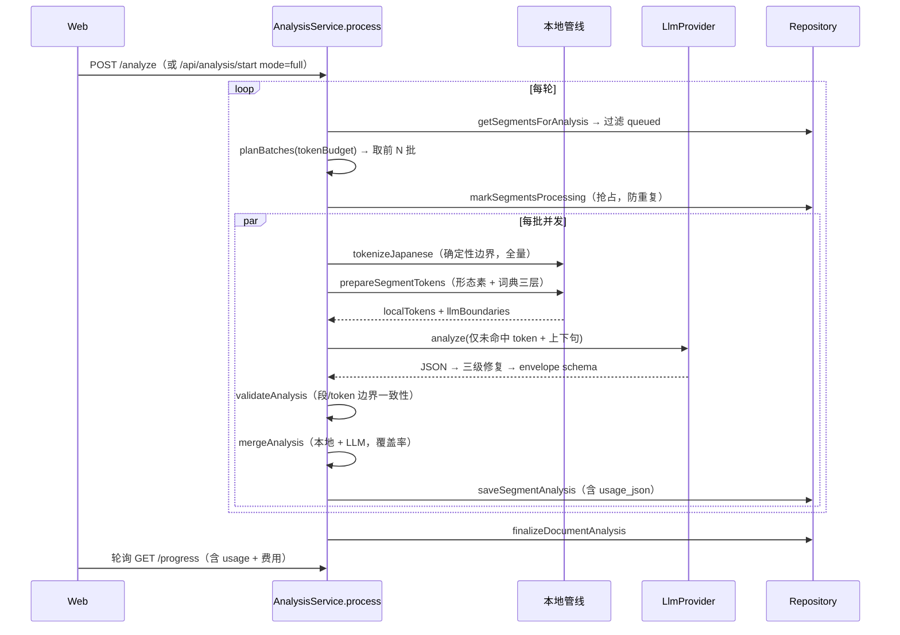
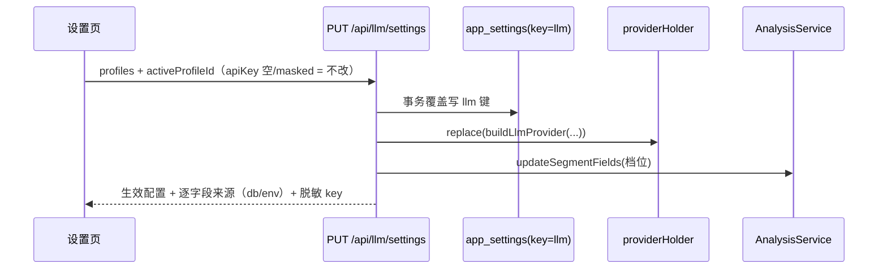
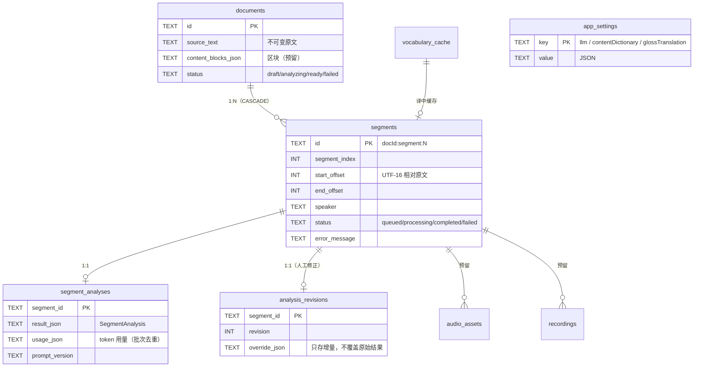

# 系统架构设计（现状 · as-built）

**文档定位**：本文描述**代码当前实际实现的架构**（截至 2026-09-12），回答「系统由哪些模块组成、数据怎么流」。
`docs/architecture.md` 是**目标方案与设计意图**（含 `CanonicalAnalysis`/`LevelExplanation`/`AnnotationRange` 等尚未落地的层次），两者不要混用：排期看 `architecture.md` + `roadmap.md`，改代码看本文。

**一句话概括**：浏览器只做展示与交互，本机 Node 服务负责分句、确定性分词、本地词典查词、LLM 编排与落盘；模型只解释「本地查不到的词」，且必须先过 schema 校验与边界校验才能入库。

---

## 一、分层总览

**运行时拓扑**

| 组件 | 位置 | 说明 |
| --- | --- | --- |
| Web | `http://127.0.0.1:5173` | Vite dev server，`/api` 反向代理到 API |
| API | `http://127.0.0.1:8787` | 只绑 `127.0.0.1`，无鉴权（单用户本机） |
| 数据库 | `apps/api/data/nihongonote.db` | sql.js（WASM），内存态 + 延迟落盘 |
| LLM | 云端 DeepSeek 或本机 Ollama | 由设置页/`.env` 决定，运行时热切换 |

---

## 二、核心模块

### 2.1 `packages/core` —— 共享契约

`domain.ts` 是前后端唯一的真相来源：所有 Zod schema 与类型在这里定义，API 响应与前端解析用同一份 schema，**不存在「后端改了前端不知道」**。

关键契约：`DocumentDetail` / `SegmentView` / `SegmentAnalysis` / `TokenAnalysis` / `AnalysisProgress` / `AnalysisPreview` / `LlmSettingsState`。

设计细节：可空字段大量使用 `.default(null)`，让「模型漏输出一个字段」降级为「该字段为空」，而不是整段分析作废（历史上被 `confidence: Required`、`politeness: Required` 坑过）。

### 2.2 路由层 `apps/api/src/routes/`

| 路由 | 文件 | 职责 |
| --- | --- | --- |
| `GET/POST /api/documents`、`GET/PATCH/DELETE /api/documents/:id` | `documents.ts` | 文章 CRUD、列表搜索与状态筛选 |
| `PATCH /api/segments/:id`、`PATCH /api/segments/:id/analysis` | `documents.ts` | 说话人修正、人工解析修正（写 `analysis_revisions`） |
| `POST /api/documents/:id/analyze` `/cancel`、`GET /progress`、`POST /api/segments/:id/retry` | `analysis.ts` | 单篇分析启停与单段重试 |
| `POST /api/analysis/preview`、`POST /api/analysis/start` | `analysis.ts` | 工具页：批量预览（零 LLM）与批量启动 |
| `GET/PUT /api/llm/settings`、`GET /api/llm/balance` | `llm.ts` | LLM 多配置管理与余额代理（key 脱敏） |
| `GET/PUT /api/content-dictionary/settings` | `content-dictionary.ts` | 内容词数据源切换 |
| `GET/PUT /api/gloss-translation/settings` | `gloss-translation.ts` | 译中（英文释义 → 中文）开关 |
| `GET /api/health` | `health.ts` | 健康检查 |

### 2.3 编排层 `services/analysis-service.ts`

整个系统最核心的模块，持有 `activeRuns: Map<documentId, {id, controller, completion}>`：

- **装箱**：按「估算 completion token」而非固定段数分批（`planBatches`），预算 = `provider.completionTokenBudget × 0.77`；每轮取前 `batchConcurrency` 批并发。
- **取消**：`AbortController.abort()` 中止在途请求，循环里每步检查 `isCurrent()`，未完成的段回到 `queued`。
- **重试**：provider 整批异常自动重试 1 次（间隔 1s）；**逐段 schema 校验失败不重试**（属于模型系统性偏差，重试无益）。
- **校验**：`validateAnalysis()` 校验 segmentId 一致、token 数量一致、tokenId 无重复、每个 token 的 `startOffset/endOffset/surface` 与本地边界完全一致。
- **合并**：`mergeAnalysis()` 把「本地命中 token」+「LLM 未命中 token」按本地边界顺序合并，附加 `schemaVersion=1` 与 `dictionaryCoverage`。
- **进度口径统一**：所有对外返回进度的入口都走 `getProgress()`，额外拼上 usage 与费用估算。

### 2.4 本地分析管线（零 token）

调用顺序固定，逐层「能本地确定就别问模型」：

| 层 | 文件 | 产出 |
| --- | --- | --- |
| 分句 | `segmentation.ts` | `Turn`（说话人 + 行区间）→ 按句末标点切 `Segment`，生成稳定 ID `${documentId}:segment:${index}`，并断言偏移与原文逐字符吻合 |
| 分词 | `tokenization.ts` | `Intl.Segmenter("ja")` + 两遍碎片合并（先向左、再向右）+ 助词白名单保护，产出 `TokenBoundary`，ID = `${segmentId}:token:${index}` |
| 形态素 | `morphology.ts` | kuromoji（IPADIC，单例懒加载）产出 `lemma / reading / partOfSpeech / conjugation`；`alignMorphology()` 按偏移区间对齐，**代表 token 的 surface 必须是本地 token 的前缀，否则宁可留空** |
| ① 固定用法库 | `dictionary/lookup.ts` + `data.ts` | 助词/功能词/句末模板查表，命中即 `source="dictionary"` |
| ② 内容词词典层 | `dictionary/content/*` | 可插拔：`none`（默认）/ `fixture` / `jmdict-common`；surface 直击 → lemma 回退 |
| ③ 译中 | `dictionary/content/translator.ts` | 本地 Ollama 把英文释义译成中文，结果缓存进 `vocabulary_cache`；失败回退英文，不阻断分析 |
| ④ LLM | `providers/*` | 只处理前三层都没命中的 token |

### 2.5 Provider 适配层 `providers/`

`LlmProvider` 接口：`name / protocol / model / configured / completionTokenBudget / analyze() / fetchBalance()`。

- `OpenAiCompatibleLlmProvider` —— 官方 OpenAI SDK，用于 DeepSeek/OpenAI 兼容端点；`response_format: json_object`；自动重试显式关闭（避免重复扣费）。
- `OllamaProvider` —— **原生 `/api/chat`**（不用 OpenAI 兼容层：实测兼容层强制 `num_ctx=4096` 且关不掉 qwen3.5 的 thinking）；`think:false`、`num_ctx` 按预算 + 4096、输出预算封顶 8192（防 16GB VRAM OOM）；`configured` 恒 true，`fetchBalance()` 返回 null。
- 响应解析三级修复链：原样 `JSON.parse` → `escapeControlCharacters` → `repairStrayQuotes`（本地 9B 模型会稳定把全角闭引号 `”` 退化成 ASCII `"`）。

注册表返回**可变 holder**（`{ current, replace() }`），设置页保存后热切换，无需重启。

### 2.6 存储层 `db/`

sql.js（WASM，免原生编译）。**没有增量落盘**：每次写要 `export()` 整库，因此实现为「标脏 → 空闲 2s 后写一次 → 退出前补写 → 临时文件 `renameSync` 原子替换」。最坏情况丢最后 2 秒写入，由 `recoverInterruptedAnalyses()` 把 `processing` 段回退为 `queued` 兜底。

配置优先级：**数据库 `app_settings` 覆盖 `.env` 覆盖代码默认值**。清空 `app_settings` 的 llm 键即回到 `.env`。

---

## 三、数据流

### 3.1 建文与分句（写路径）

### 3.2 完整分析（核心链路）

### 3.3 仅词典分析（零费用）

`startDictionaryOnly()` 对每条 `queued` 段跑本地管线，命中者瘦身落库（省略恒定 null 字段），未命中 token 不编造解释；句段级语义字段（translation/tone 等）全为 null。已完成/失败的段跳过——重复运行不会重复计费，也不会删掉已有 AI 分析。

### 3.4 预览（零 LLM）

`POST /api/analysis/preview` → `countSegmentTokens()`（分词 + 本地三层）→ `estimateAnalysisTokens(段数, 未命中数, 档位)` → `estimatePreviewCost()` 按内置价格表给出闲时/高峰两档。**全程不调用模型**，是成本治理（LLM-011：未经用户确认不得发起解析）的落地手段。

### 3.5 设置与热切换

---

## 四、数据模型

**ID 与偏移稳定性**（整个系统的地基）：

- 所有 ID 可推导：`${documentId}:segment:${index}`、`${segmentId}:token:${index}`。
- 所有偏移是**相对原文/句段的 UTF-16 偏移**，前端不做字符串搜索定位。
- `assertSegmentsMatchSource()` 在建文时硬校验；分析入库前再校验一次 token 边界。**任何一环不一致就失败，不做模糊匹配**。

---

## 五、成本治理与可靠性

**降本三件套**（都在本地完成，省的是 model 输出 token）：形态素填事实字段 → 固定用法库查助词/功能词 → 内容词词典层查词（覆盖率 none 47.8% → jmdict-common 92.7%）；只有剩下的未命中 token 才进 prompt。

**档位制**：`minimal / standard（默认）/ full` 三档，只改 system prompt 的字段要求与预览系数，schema 与存储完全兼容。

**可靠性机制**：

| 风险 | 机制 |
| --- | --- |
| 进程崩溃/重启残留 processing | `recoverInterruptedAnalyses()` 启动时回退为 queued |
| 长句段打爆 token 上限 | 按估算成本装箱 + 0.77 安全系数，单段超预算也单独成批 |
| 模型漏字段 | schema `default(null)` 降级 |
| 模型输出非法 JSON | 三级修复链（控制字符 → 引号修复） |
| 本地服务未启动 | `OllamaProvider.assertServerReady()` 探活 `/api/tags`，区分「服务未起」与「模型未装」 |
| 写库性能 | 延迟 2s 批量落盘 + 原子替换 |
| 用户反悔 | `AbortController` 中止在途请求，已完成段保留 |

**已知债**（详见 `docs/progress-audit-2026-09-02.md`）：`AnnotationRange` 范围标注、四层点击循环、`LevelExplanation`/`CanonicalAnalysis` 分层、导出、TTS、移动端抽屉均未实现；`App.tsx` 仍偏大，做范围标注前需先拆。

---

## 六、模块 → 代码索引

| 关注点 | 入口文件 |
| --- | --- |
| 应用装配与依赖注入 | `apps/api/src/app.ts` |
| 全部配置与默认值 | `apps/api/src/config.ts` |
| 分析编排 | `apps/api/src/services/analysis-service.ts` |
| 本地预处理（三层链路） | `apps/api/src/segment-preparation.ts` |
| 分句 / 分词 / 形态素 | `segmentation.ts` · `tokenization.ts` · `morphology.ts` |
| 词典与数据源 | `dictionary/lookup.ts` · `dictionary/content/index.ts` |
| Provider 与热切换 | `providers/registry.ts` · `settings.ts` |
| 装箱与预算 | `llm-budget.ts` · `llm-pricing.ts` · `analysis-preview.ts` |
| 持久化 | `db/database.ts` · `db/schema.ts` · `repositories/document-repository.ts` |
| 前端 | `apps/web/src/App.tsx` · `api/client.ts` · `components/*` |
| 共享契约 | `packages/core/src/domain.ts` |
